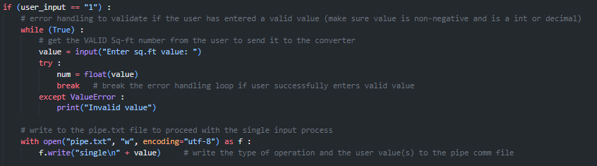

# Sq-Ft-Converter (Microservice A)
## How to Request Data from Microservice A
Using text files as the **communication pipe**, you must write the arguments/parameters to request data from the microservice to the **pipe.txt** file.
### Making Single Conversion
To convert one value from Sq.ft to Sq.m, the pipe.txt file must have **2 arguments** separated by each line: process type and input.
1. Using the UI/client program, the user will be prompted to enter a VALID value to send to the microservice. A VALID value is any whole or decimal number, it allows the value to be negative as well.  
Code snippet for data request of single conversion:
     
Example in UI: The user wants to get a single conversion for 100 Sq.ft
  

### Making Multiple Conversions
## How to Receive Data from Microservice A
