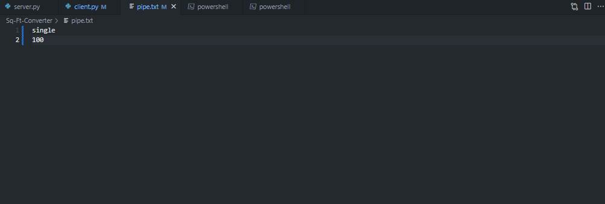
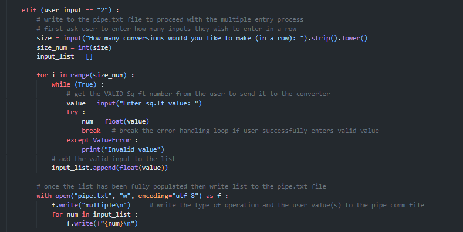
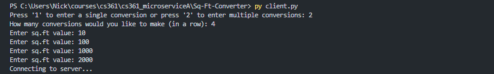
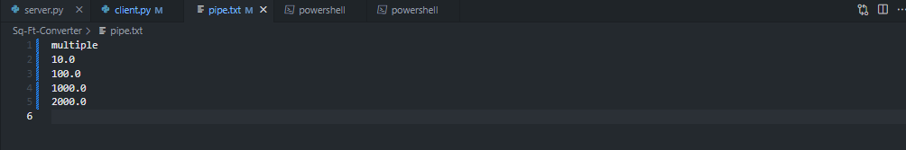
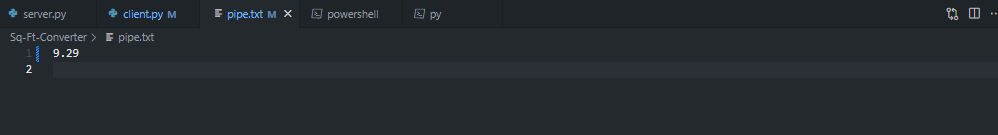
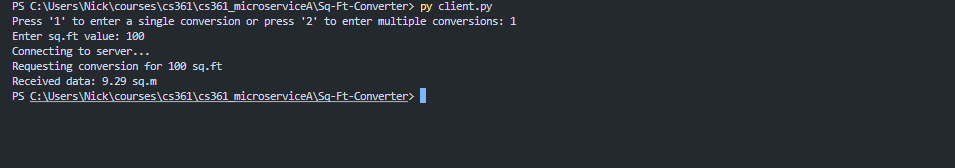
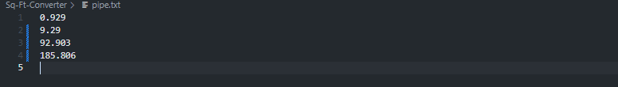
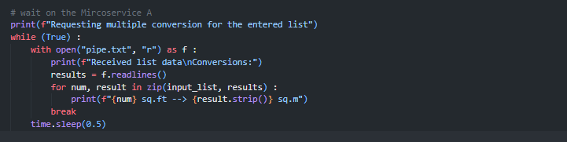
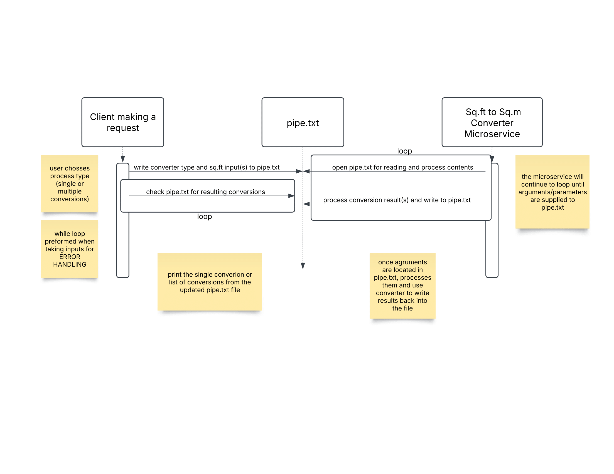

# Sq-Ft-Converter (Microservice A)

## How to Request Data from Microservice A
Using text files as the **communication pipe**, you must write the arguments/parameters to request data from the microservice to the **pipe.txt** file. **ADVISE: it is not required to test the program**

### Making Single Conversion
To convert one value from Sq.ft to Sq.m, the pipe.txt file must have **2 arguments** separated by each line: process type and input.

1. Using the UI/client program, the user will be prompted to enter a VALID value to send to the microservice. A VALID value is any whole or decimal number, it allows the value to be negative as well.  

Code snippet for data request of single conversion: 
     
  
Example in UI: The user wants to get a single conversion for 100 Sq.ft 
     

2. The client program should have sent 2 lines to the pipe.txt file to indicate that this is a single conversion process request   

Example pipe.txt content for the request of a single conversion for 100 Sq.ft
   

### Making Multiple Conversions
To convert multiple values from Sq.ft to Sq.m, the pipe.txt file must have the process type in the first line followed by the number of inputs the user wishes to convert, separated by lines

1. Using the UI/client program, the user will be prompted to enter multiple VALID values to send to the microservice all at once. A VALID value is any whole or decimal number, it allows the value to be negative as well. This will then be added to a list to send to the microservice.   

Code snippet for data request of multiple conversions:
     

Example in UI: The user wants to enter 4 separate conversions for values of 10, 100, 1000, and 2000 Sq.ft
   

2. The client program should have sent multiple lines to the pipe.txt file to indicate that the user requests multiple conversions   

Example pipe.txt content for the request of 4 separate conversions for values of 10, 100, 1000, and 2000 Sq.ft
   

## How to Receive Data from Microservice A
Using text files as the **communication pipe**, you must read the results from the **pipe.txt** file entered by the microservice after a request has been sent.

### Getting Single Conversion
To get one resulting value from Sq.ft to Sq.m converter, the pipe.txt file must have **1 line** after a request has been made, which should be the resulting conversion of the user's input.

1. The microservice, after a request has been made, should have updated the pipe.txt file by writing the resulting conversion to the communication pipe.   

Example pipe.txt content for writing the result of a single conversion for 100 Sq.ft
   

2. Using the client program, the user will be prompted a confirmation that it requested data from the microservice, wait for the pipe.txt file to update, and display the received single result by reading the updated pipe.txt file.   

Code snippet of receiving results for a single conversion from the microservice 
   

Example in UI: User receives the single resulting conversion for 100 Sq.ft
   

### Getting Multiple Conversions
To get multiple resulting values from Sq.ft to Sq.m converter, the pipe.txt file must have **the same number of resulting values as the input list** after a request has been made, which should be the resulting list of  conversion given by the user's inputs.

1. The microservice, after a request has been made, should have updated the pipe.txt file by writing the resulting list of conversions to the communication pipe.   

Example of pipe.txt content after a request has been made and results have been updated to the file for values 10, 100, 1000, 2000 Sq.ft
   

2. Using the client program, the user will be prompted a confirmation that it requested data from the microservice, wait for the pipe.txt file to update, and display the received results by reading the updated pipe.txt file.   

Code snippet of receiving multiple results for a multi-processing conversion request from the microservice
   

Example in UI: User receives multiple resulting conversions for 10, 100, 1000, 2000 Sq.ft
   

## UML Sequenece Diagram

