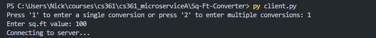

# Sq-Ft-Converter (Microservice A)

## How to Request Data from Microservice A
Using text files as the **communication pipe**, you must write the arguments/parameters to request data from the microservice to the **pipe.txt** file.

### Making Single Conversion
To convert one value from Sq.ft to Sq.m, the pipe.txt file must have **2 arguments** separated by each line: process type and input.

1. Using the UI/client program, the user will be prompted to enter a VALID value to send to the microservice. A VALID value is any whole or decimal number, it allows the value to be negative as well.  

Code snippet for data request of single conversion:
     
  
Example in UI: The user wants to get a single conversion for 100 Sq.ft
     

2. The client program should have sent 2 lines to the pipe.txt file to indicate that this is a single conversion process request

Example pipe.txt content for the request of a single conversion for 100 Sq.ft
   

### Making Multiple Conversions
To convert multiple values from Sq.ft to Sq.m, the pipe.txt file must have the process type in the first line followed by the number of inputs the user wishes to convert, separated by lines

1. Using the UI/client program, the user will be prompted to enter multiple VALID values to send to the microservice all at once. A VALID value is any whole or decimal number, it allows the value to be negative as well. This will then be added to a list to send to the microservice.   

Code snippet for data request of multiple conversions:
   

Example in UI: The user wants to enter 4 separate conversions for values of 10, 100, 1000, and 2000 Sq.ft

2. The client program should have sent multiple lines to the pipe.txt file to indicate that the user requests multiple conversions

Example pipe.txt content for the request of 4 separate conversions for values of 10, 100, 1000, and 2000 Sq.ft

## How to Receive Data from Microservice A
